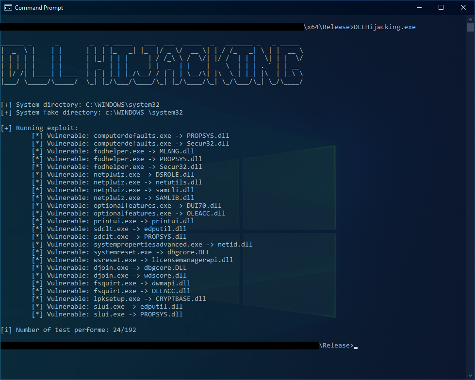

# UAC bypass - DLL hijacking 

## Description

This is a PoC for bypassing [UAC](https://docs.microsoft.com/en-us/windows/security/identity-protection/user-account-control/how-user-account-control-works) using [DLL hijacking](https://attack.mitre.org/techniques/T1574/001/) and abusing the "Trusted Directories" verification. 

## Summary

- [Generate Header from CSV](#generate-header-from-csv)
    - [Arguments](#arguments)
- [Generate the list of vulnerable PE and DLL](#generate-the-list-of-vulnerable-pe-and-dll)
    - [DLLHijacking.exe](#dllhijackingexe)
    - [Log file](#log-file)
    - [Execution](#execution)
    - [Result](#result)
- [test.dll](#testdll)
- [Sources](#sources)

## Generate Header from CSV

The python script `CsvToHeader.py` can be used to generate a header file. By default it will use the CSV file `dll_hijacking_candidates.csv` that can be found here: [dll_hijacking_candidates.csv](https://raw.githubusercontent.com/wietze/windows-dll-hijacking/master/dll_hijacking_candidates.csv).

The script will check for each portable executable(PE) the following condition:
- If the PE exists in the file system.
- In the manifest of the PE, if the _requestedExecutionLevel_ is set to one of the following values: 
  - `asInvoker`
  - `highestAvailable` 
  - `requireAdministrator`
- In the manifest if the autoElevate is set to true:
    ```xml
    <autoElevate>true</autoElevate>
    ```
- If the user specified the `-c` argument, the script will check if the DLL to hijack is in the list of DLLs imported form PE table.

### Arguments 

```
> python .\CsvToHeader.py -h
usage: CsvToHeader.py -f [DLL_PATH] -c

CsvToHeader can be used to generate a header file from a CSV.

optional arguments:
  -h, --help      show this help message and exit
  -f  [DLL_PATH]  Path of the csv to convert (default="dll_hijacking_candidates.csv")
  -c              Enable import dll in PE (default=False)
  -v, --version   Show program's version number and exit
```

To generate the header file you can use the following command:

    python CsvToHeader.py > dll_hijacking_candidates.h


## Generate the list of vulnerable PE and DLL

The files that will be used are `DLLHijacking.exe` and `test.dll`.

### DLLHijacking.exe

DLLHijacking.exe is the file that will be used to generate the list of vulnerable PE.
It will perform the following steps:
1. CreateFakeDirectory 
   
    Function that create a directory in `C:\windows \system32`.

2. Copy Files in the new directory
     - from `C:\windows\system32\[TARGET.EXE]` to `C:\windows \system32\[TARGET.EXE]`
     - from `[CUSTOM_DLL_PATH]` to `C:\windows \system32\[TARGET.DLL]`
3. Trigger
   
   Run the executable from `C:\windows \system32\[TARGET.EXE]`

4. CleanUpFakeDirectory

    Function that delete the directory created in step 1 and files from step 2.
5. CheckExploit

    Check the content of the file `C:\ProgramData\exploit.txt` to see if the exploit was successful.

### Log file

DLLHijacking.exe will always generate a log file `exploitable.log` with the following content:
- 0 or 1 to indicates whether the exploit was able to bypass the UAC.
- The executable name
- The dll name
  
E.g.
```
1,computerdefaults.exe,PROPSYS.dll
0,computerdefaults.exe,Secur32.dll
```

### Execution 

Command to run:

    DLLHijacking.exe [DLL_PATH]

if no argument is passed, the script will use the DLL `test.dll` which is stored in the resouce of `DLLHijacking.exe`.

### Result

Tested on Windows 10 Pro (10.0.19043 N/A Build 19043).



## test.dll

`test.dll` is a simple dynamic library that will be use to see if the exploit is successfully.
The DLL will create a file `C:\ProgramData\exploit.txt` with the following content:
- 0 or 1 to indicates whether the exploit was able to bypass the UAC.
- The executable name
- The DLL name

This file will be deleted once the exploit is complete.

## Sources:

- https://www.wietzebeukema.nl/blog/hijacking-dlls-in-windows
- https://github.com/wietze/windows-dll-hijacking/
- https://github.com/wietze/windows-dll-hijacking/blob/master/dll_hijacking_candidates.csv
- https://medium.com/tenable-techblog/uac-bypass-by-mocking-trusted-directories-24a96675f6e


## Legal Disclaimer:

    This project is made for educational and ethical testing purposes only. Usage of this software for attacking targets without prior mutual consent is illegal. 
    It is the end user's responsibility to obey all applicable local, state and federal laws. 
    Developers assume no liability and are not responsible for any misuse or damage caused by this program.
